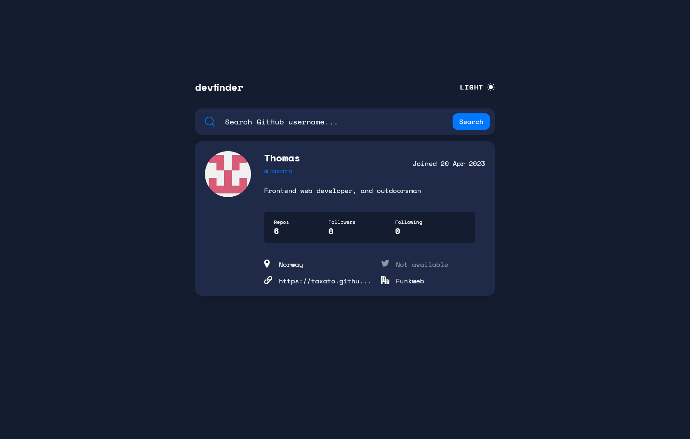
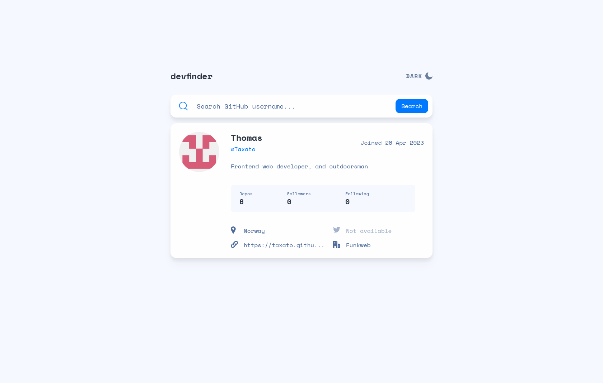

# Frontend Mentor - GitHub user search app solution

This is a solution to the [GitHub user search app challenge on Frontend Mentor](https://www.frontendmentor.io/challenges/github-user-search-app-Q09YOgaH6). Frontend Mentor challenges help you improve your coding skills by building realistic projects.

## Table of contents

-   [The challenge](#the-challenge)
-   [Screenshot](#screenshot)
-   [Links](#links)
-   [Built with](#built-with)
-   [Author](#author)

### The challenge

Users should be able to:

-   View the optimal layout for the app depending on their device's screen size
-   See hover states for all interactive elements on the page
-   Search for GitHub users by their username
-   See relevant user information based on their search
-   Switch between light and dark themes
-   **Bonus**: Have the correct color scheme chosen for them based on their computer preferences. _Hint_: Research `prefers-color-scheme` in CSS.

### Screenshots

### Links

-   Solution URL: [Frontend Mentor](https://www.frontendmentor.io/solutions/responsive-app-using-github-users-api-DwSS-8pJu8)
-   Live Site URL: [Github pages](https://taxato.github.io/Github-user-search-app/)

### Built with

-   vite
-   React
-   TailwindCSS with custom theme

## Author

-   Website - [TGS Portfolio](https://taxato.github.io/TGS-Portfolio/)
-   Frontend Mentor - [@Taxato](https://www.frontendmentor.io/profile/Taxato)
